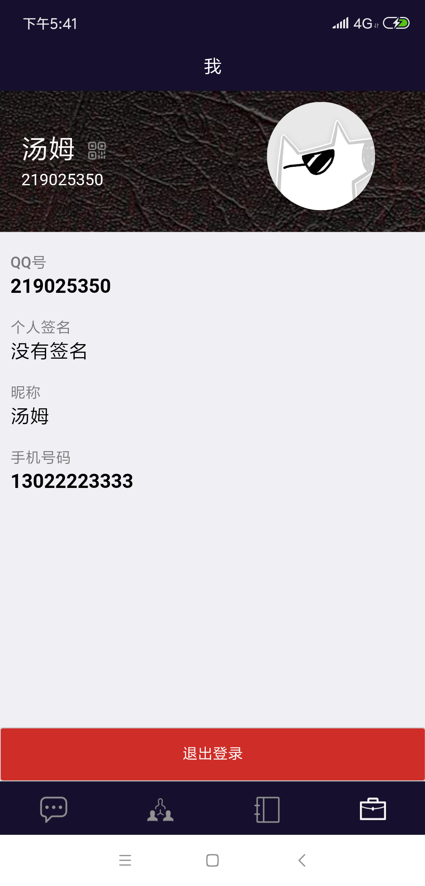
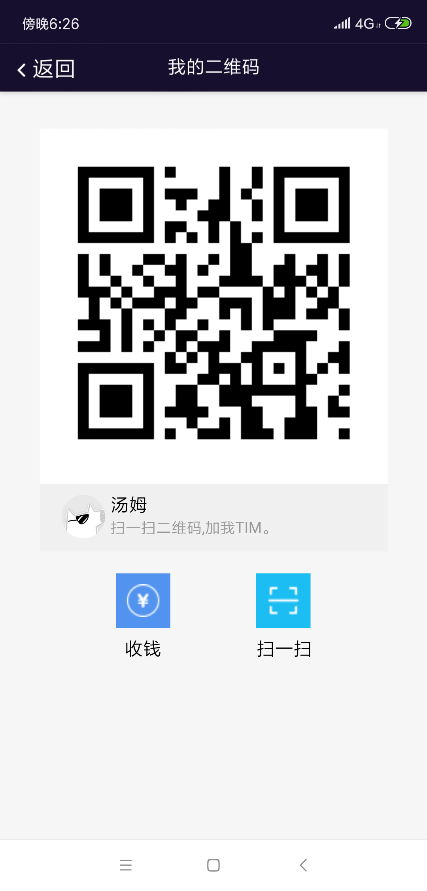
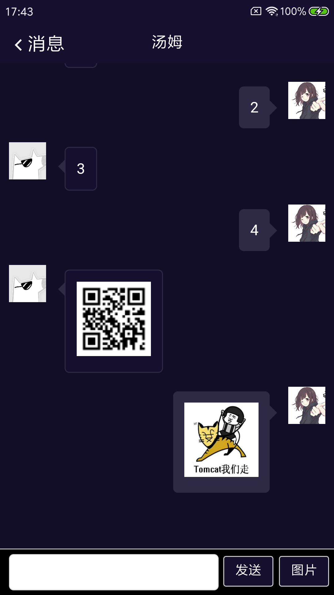
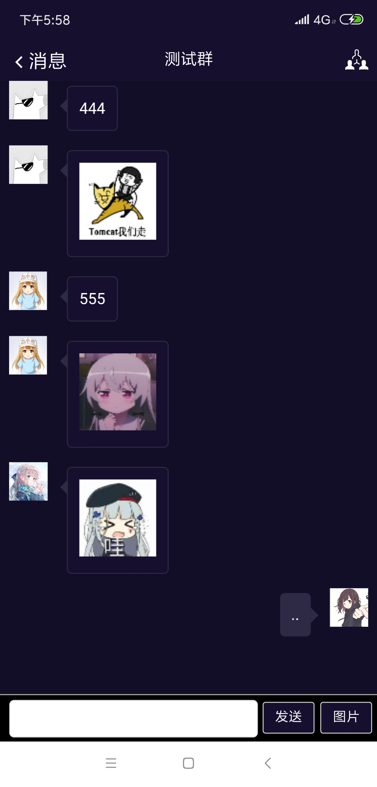
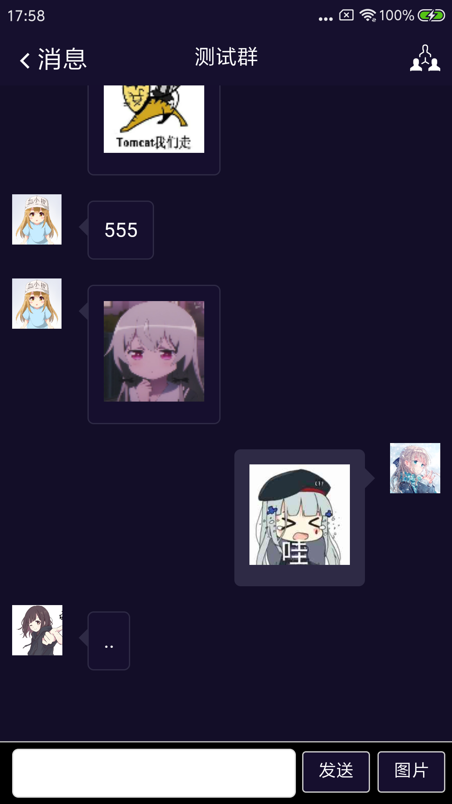
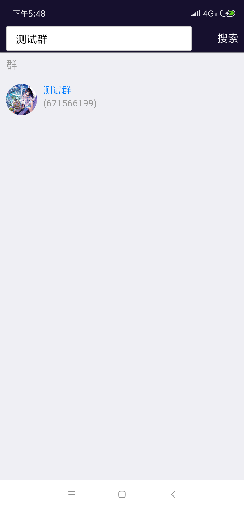
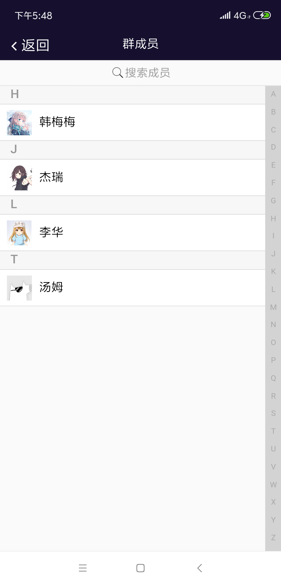

## 仿造实现TIM
## 技术栈
	移动端: MUI + Handlebars + Jquery
	服务端: SpringBoot + Netty + MyBatis  
	数据库: Mysql + Redis
## 功能
1. 添加好友,创建加入群
2. 私聊、群聊发送文字图片  
3. 缓存聊天记录和聊天快照记录  
4. 未读消息的获取与签收  
5. 二维码添加好友更换剪切头像

## 效果

	
